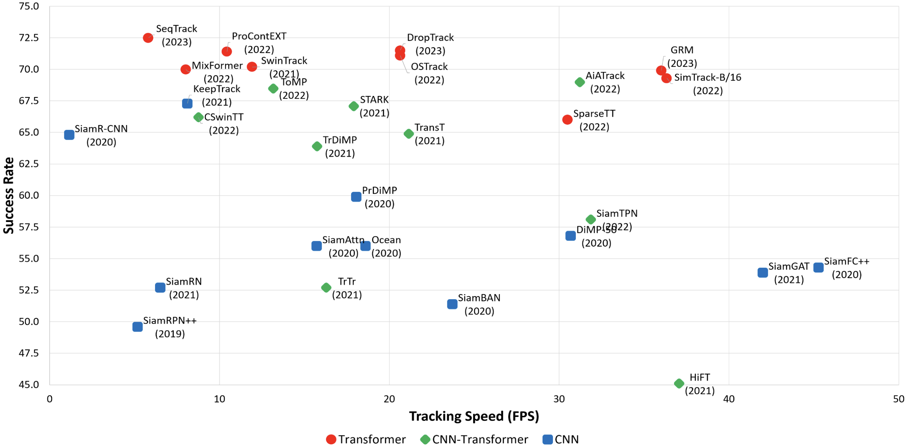
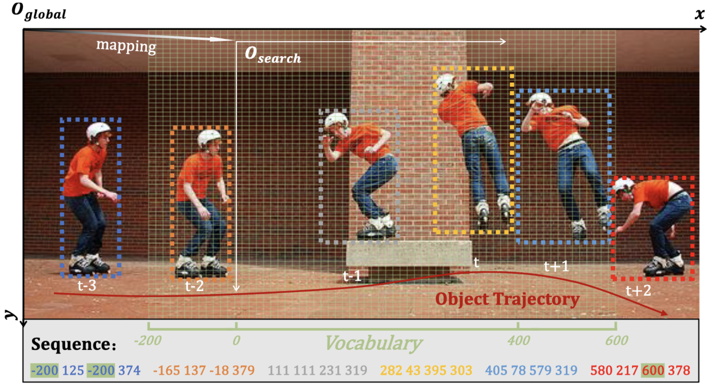
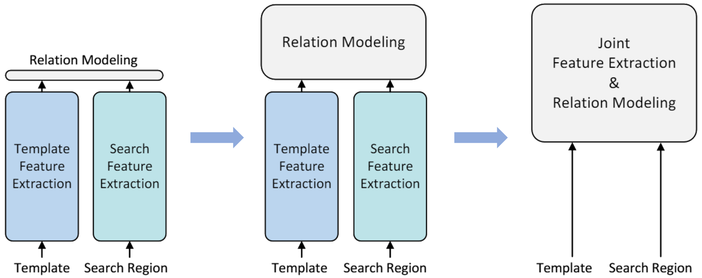

# Transformer Tracking

This repository is a paper digest of [Transformer](https://arxiv.org/abs/1706.03762)-related approaches in visual tracking tasks. Currently, tasks in this repository include **Unified Tracking (UT)**, **Single Object Tracking (SOT)** and **3D Single Object Tracking (3DSOT)**. Note that some trackers involving a [Non-Local](https://arxiv.org/abs/1711.07971) attention mechanism are also collected. Papers are listed in alphabetical order of the first character.

### :link:Jump to:
- ### [[Unified Tracking](https://github.com/Little-Podi/Transformer_Tracking#bookmarkunified-tracking-ut)]
- ### [[Single Object Tracking](https://github.com/Little-Podi/Transformer_Tracking#bookmarksingle-object-tracking-sot)]
- ### [[3D Single Object Tracking](https://github.com/Little-Podi/Transformer_Tracking#bookmark3d-single-object-tracking-3dsot)]

> [!NOTE] 
> I find it hard to trace all tasks that are related to tracking, including Video Object Segmentation (VOS), Multiple Object Tracking (MOT), Video Instance Segmentation (VIS), Video Object Detection (VOD) and Object Re-Identification (ReID). Hence, I discard all other tracking tasks in a previous update. If you are interested, you can find plenty of collections in [this archived version](https://github.com/Little-Podi/Transformer_Tracking/tree/4cc6050c07dfd4ecbc9f6aa584601a457ed84eb3). Besides, the most recent trend shows that different tracking tasks are coming to the same avenue.

## :star2:Recommendation

### Game Over???

- ### [SAM 2](https://ai.meta.com/SAM2) [[paper](https://ai.meta.com/research/publications/sam-2-segment-anything-in-images-and-videos)] [[code](https://github.com/facebookresearch/segment-anything-2)] [[example](https://arxiv.org/abs/2409.16902)]

### State-of-the-Art Transformer Tracker:two_hearts::two_hearts::two_hearts:

- **GRM** (Generalized Relation Modeling for Transformer Tracking) [[paper](https://arxiv.org/abs/2303.16580)] [[code](https://github.com/Little-Podi/GRM)] [[video](https://youtu.be/bQKN3HV-8XI)]
- **AiATrack** (AiATrack: Attention in Attention for Transformer Visual Tracking) [[paper](https://arxiv.org/abs/2207.09603)] [[code](https://github.com/Little-Podi/AiATrack)] [[video](https://youtu.be/TqNiOWx9cnI)]

### Up-to-Date Benchmark Results:rocket::rocket::rocket:

- Image courtesy: https://arxiv.org/abs/2302.11867

### Helpful Learning Resource for Tracking:thumbsup::thumbsup::thumbsup:

- **(Survey)** Transformers in Single Object Tracking: An Experimental Survey [[paper](https://arxiv.org/abs/2302.11867)], Visual Object Tracking with Discriminative Filters and Siamese Networks: A Survey and Outlook [[paper](https://arxiv.org/abs/2112.02838)]
- **(Talk)** Discriminative Appearance-Based Tracking and Segmentation [[video](https://youtu.be/ILVnBhFq2Ds)], Deep Visual Reasoning with Optimization-Based Network Modules [[video](https://youtu.be/UR2TlFCrYac)]
- **(Library)** PyTracking: Visual Tracking Library Based on PyTorch [[code](https://github.com/visionml/pytracking)]
- **(People)** Martin Danelljan@ETH [[web](https://martin-danelljan.github.io)], Bin Yan@DLUT [[web](https://masterbin-iiau.github.io)]

### Recent Trends:fire::fire::fire:

- ### Target Head: Autoregressive Temporal Modeling

  - #### Representative

    - Bounding box as coordinate sequence.
      - **ARTrackV2** [[CVPR'24](https://github.com/Little-Podi/Transformer_Tracking#cvpr-2024-1)] **ARTrack** [[CVPR'23](https://github.com/Little-Podi/Transformer_Tracking#cvpr-2023-1)], **SeqTrack** [[CVPR'23](https://github.com/Little-Podi/Transformer_Tracking#cvpr-2023-1)]

  

- ### Feature Backbone: Joint Feature Extraction and Interaction

  - #### Advantage

    - Benefit from pre-trained vision Transformer models.
    - Free from randomly initialized correlation modules.
    - More discriminative target-specific feature extraction.
    - Much faster inference and training convergence speed.
    - Simple and generic one-branch tracking framework.

  - #### Roadmap

    - 1st step :feet: feature interaction inside the backbone.
      - **SiamAttn** [[CVPR'20](https://github.com/Little-Podi/Transformer_Tracking#cvpr-2020)], **SBT** [[CVPR'22](https://github.com/Little-Podi/Transformer_Tracking#cvpr-2022-1)], **InMo** [[IJCAI'22](https://github.com/Little-Podi/Transformer_Tracking#ijcai-2022)]
    - 2nd step :feet: concatenation-based feature interaction.
      - **STARK** [[ICCV'21](https://github.com/Little-Podi/Transformer_Tracking#iccv-2021)], **SwinTrack** [[NeurIPS'22](https://github.com/Little-Podi/Transformer_Tracking#neurips-2022)]
    - 3rd step :feet: joint feature extraction and interaction.
      - **MixFormer** [[CVPR'22](https://github.com/Little-Podi/Transformer_Tracking#cvpr-2022-1)], **OSTrack** [[ECCV'22](https://github.com/Little-Podi/Transformer_Tracking#eccv-2022-1)], **SimTrack** [[ECCV'22](https://github.com/Little-Podi/Transformer_Tracking#eccv-2022-1)]
    - 4th step :feet: generalized and robust relation modeling.
      - **GRM** [[CVPR'23](https://github.com/Little-Podi/Transformer_Tracking#cvpr-2023-1)], **ROMTrack** [[ICCV'23](https://github.com/Little-Podi/Transformer_Tracking#iccv-2023)].

  

## :bookmark:Unified Tracking (UT)

### CVPR 2024

- **GLEE** (General Object Foundation Model for Images and Videos at Scale) [[paper](https://arxiv.org/abs/2312.09158)] [[code](https://github.com/FoundationVision/GLEE)]
- **OmniViD** (OmniVid: A Generative Framework for Universal Video Understanding) [[paper](https://arxiv.org/abs/2403.17935)] [[code](https://github.com/wangjk666/OmniVid)]

### CVPR 2023

- **OmniTracker** (OmniTracker: Unifying Object Tracking by Tracking-with-Detection) [[paper](https://arxiv.org/abs/2303.12079)] [~~code~~]
- **UNINEXT** (Universal Instance Perception as Object Discovery and Retrieval) [[paper](https://arxiv.org/abs/2303.06674)] [[code](https://github.com/MasterBin-IIAU/UNINEXT)]

### ICCV 2023

- **MITS** (Integrating Boxes and Masks: A Multi-Object Framework for Unified Visual Tracking and Segmentation) [[paper](https://arxiv.org/abs/2308.13266)] [[code](https://github.com/yoxu515/MITS)]

### Preprint 2023

- **HQTrack** (Tracking Anything in High Quality) [[paper](https://arxiv.org/abs/2307.13974)] [[code](https://github.com/jiawen-zhu/HQTrack)]
- **SAM-Track** (Segment and Track Anything) [[paper](https://arxiv.org/abs/2305.06558)] [[code](https://github.com/z-x-yang/Segment-and-Track-Anything)]
- **TAM** (Track Anything: Segment Anything Meets Videos) [[paper](https://arxiv.org/abs/2304.11968)] [[code](https://github.com/gaomingqi/Track-Anything)]

### CVPR 2022

- **UTT** (Unified Transformer Tracker for Object Tracking) [[paper](https://arxiv.org/abs/2203.15175)] [[code](https://github.com/Flowerfan/Trackron)]

### ECCV 2022

- **Unicorn** (Towards Grand Unification of Object Tracking) [[paper](https://arxiv.org/abs/2207.07078)] [[code](https://github.com/MasterBin-IIAU/Unicorn)]

## :bookmark:Single Object Tracking (SOT)

### CVPR 2024

- **AQATrack** (Autoregressive Queries for Adaptive Tracking with Spatio-Temporal Transformers) [[paper](https://arxiv.org/abs/2403.10574)] [[code](https://github.com/GXNU-ZhongLab/AQATrack)]
- **ARTrackV2** (ARTrackV2: Prompting Autoregressive Tracker Where to Look and How to Describe) [[paper](https://arxiv.org/abs/2312.17133)] [~~code~~]
- **DiffusionTrack** (DiffusionTrack: Point Set Diffusion Model for Visual Object Tracking) [[paper](https://openaccess.thecvf.com/content/CVPR2024/html/Xie_DiffusionTrack_Point_Set_Diffusion_Model_for_Visual_Object_Tracking_CVPR_2024_paper.html)] [[code](https://github.com/VISION-SJTU/DiffusionTrack)]
- **HDETrack** (Event Stream-Based Visual Object Tracking: A High-Resolution Benchmark Dataset and A Novel Baseline) [[paper](https://arxiv.org/abs/2309.14611)] [[code](https://github.com/Event-AHU/EventVOT_Benchmark)]
- **HIPTrack** (HIPTrack: Visual Tracking with Historical Prompts) [[paper](https://arxiv.org/abs/2311.02072)] [[code](https://github.com/WenRuiCai/HIPTrack)]
- **OneTracker** (OneTracker: Unifying Visual Object Tracking with Foundation Models and Efficient Tuning) [[paper](https://arxiv.org/abs/2403.09634)] [~~code~~]
- **QueryNLT** (Context-Aware Integration of Language and Visual References for Natural Language Tracking) [[paper](https://arxiv.org/abs/2403.19975)] [[code](https://github.com/twotwo2/QueryNLT)]
- **SDSTrack** (SDSTrack: Self-Distillation Symmetric Adapter Learning for Multi-Modal Visual Object Tracking) [[paper](https://arxiv.org/abs/2403.16002)] [[code](https://github.com/hoqolo/SDSTrack)]
- **Un-Track** (Single-Model and Any-Modality for Video Object Tracking) [[paper](https://arxiv.org/abs/2311.15851)] [[code](https://github.com/Zongwei97/UnTrack)]

### ECCV 2024

- **Diff-Tracker** (Diff-Tracker: Text-to-Image Diffusion Models are Unsupervised Trackers) [[paper](https://arxiv.org/abs/2407.08394)] [~~code~~]
- **LoRAT** (Tracking Meets LoRA: Faster Training, Larger Model, Stronger Performance) [[paper](https://arxiv.org/abs/2403.05231)] [[code](https://github.com/LitingLin/LoRAT)]

### NeurIPS 2024

- **DeTrack** (DeTrack: In-model Latent Denoising Learning for Visual Object Tracking) [[paper&review](https://openreview.net/forum?id=ZJjuNF0olj)] [~~code~~]
- **OKTrack** (WebUOT-1M: Advancing Deep Underwater Object Tracking with A Million-Scale Benchmark) [[paper](https://arxiv.org/abs/2405.19818)] [[code](https://github.com/983632847/Awesome-Multimodal-Object-Tracking)]

### AAAI 2024

- **BAT** (Bi-Directional Adapter for Multi-Modal Tracking) [[paper](https://arxiv.org/abs/2312.10611)] [[code](https://github.com/SparkTempest/BAT)]
- **EVPTrack** (Explicit Visual Prompts for Visual Object Tracking) [[paper](https://arxiv.org/abs/2401.03142)] [[code](https://github.com/GXNU-ZhongLab/EVPTrack)]
- **ODTrack** (ODTrack: Online Dense Temporal Token Learning for Visual Tracking) [[paper](https://arxiv.org/abs/2401.01686)] [[code](https://github.com/GXNU-ZhongLab/ODTrack)]
- **STCFormer** (Sequential Fusion Based Multi-Granularity Consistency for Space-Time Transformer Tracking) [[paper](https://ojs.aaai.org/index.php/AAAI/article/view/29145)] [~~code~~]
- **TATrack** (Temporal Adaptive RGBT Tracking with Modality Prompt) [[paper](https://arxiv.org/abs/2401.01244)] [~~code~~]
- **UVLTrack** (Unifying Visual and Vision-Language Tracking via Contrastive Learning) [[paper](https://arxiv.org/abs/2401.11228)] [[code](https://github.com/OpenSpaceAI/UVLTrack)]

### ICML 2024

- **AVTrack** (Learning Adaptive and View-Invariant Vision Transformer for Real-Time UAV Tracking) [[paper](https://openreview.net/forum?id=eaNLvrP8n1)] [[code](https://github.com/wuyou3474/AVTrack)]

### IJCAI 2024

- **DMTrack** (Diffusion Mask-Driven Visual-language Tracking) [[paper](https://www.ijcai.org/proceedings/2024/183)] [~~code~~]
- **USTrack** (Unified Single-Stage Transformer Network for Efficient RGB-T Tracking) [[paper](https://arxiv.org/abs/2308.13764)] [[code](https://github.com/xiajianqiang/USTrack)]

### MM 2024

- **ATTracker** (Consistencies are All You Need for Semi-Supervised Vision-Language Tracking) [[paper&review](https://openreview.net/forum?id=jLJ3htNxVX)] [~~code~~]

### WACV 2024

- **SMAT** (Separable Self and Mixed Attention Transformers for Efficient Object Tracking) [[paper](https://arxiv.org/abs/2309.03979)] [[code](https://github.com/goutamyg/SMAT)]
- **TaMOs** (Beyond SOT: It's Time to Track Multiple Generic Objects at Once) [[paper](https://arxiv.org/abs/2212.11920)] [[code](https://github.com/visionml/pytracking)]

### ICRA 2024

- **DCPT** (DCPT: Darkness Clue-Prompted Tracking in Nighttime UAVs) [[paper](https://arxiv.org/abs/2309.10491)] [[code](https://github.com/bearyi26/DCPT)]

### IROS 2024

- **CGDenoiser** (Conditional Generative Denoiser for Nighttime UAV Tracking) [[paper](https://arxiv.org/abs/2409.16834)] [[code](https://github.com/vision4robotics/CGDenoiser)]
- **DaDiff** (DaDiff: Domain-Aware Diffusion Model for Nighttime UAV Tracking) [~~paper~~] [[code](https://github.com/vision4robotics/DaDiff)]
- **LDEnhancer** (Enhancing Nighttime UAV Tracking with Light Distribution Suppression) [[paper](https://arxiv.org/abs/2409.16631)] [[code](https://github.com/vision4robotics/LDEnhancer)]
- **PRL-Track** (Progressive Representation Learning for Real-Time UAV Tracking) [[paper](https://arxiv.org/abs/2409.16652)] [[code](https://github.com/vision4robotics/PRL-Track)]
- **TDA-Track** (TDA-Track: Prompt-Driven Temporal Domain Adaptation for Nighttime UAV Tracking) [[paper](https://arxiv.org/abs/2409.18533)] [[code](https://github.com/vision4robotics/TDA-Track)]

### Preprint 2024

- **ABTrack** (Adaptively Bypassing Vision Transformer Blocks for Efficient Visual Tracking) [[paper](https://arxiv.org/abs/2406.08037)] [[code](https://github.com/1HykhqV3rU/ABTrack)]
- **ACTrack** (ACTrack: Adding Spatio-Temporal Condition for Visual Object Tracking) [[paper](https://arxiv.org/abs/2403.07914)] [~~code~~]
- **AFter** (AFter: Attention-Based Fusion Router for RGBT Tracking) [[paper](https://arxiv.org/abs/2405.02717)] [[code](https://github.com/Alexadlu/AFter)]
- **AMTTrack** (Long-Term Frame-Event Visual Tracking: Benchmark Dataset and Baseline) [[paper](https://arxiv.org/abs/2403.05839)] [[code](https://github.com/Event-AHU/FELT_SOT_Benchmark)]
- **BofN** (Predicting the Best of N Visual Trackers) [[paper](https://arxiv.org/abs/2407.15707)] [[code](https://github.com/BasitAlawode/Best_of_N_Trackers)]
- **CAFormer** (Cross-modulated Attention Transformer for RGBT Tracking) [[paper](https://arxiv.org/abs/2408.02222)] [~~code~~]
- **CFBT** (Cross Fusion RGB-T Tracking with Bi-Directional Adapter) [[paper](https://arxiv.org/abs/2408.16979)] [~~code~~]
- **CompressTracker** (General Compression Framework for Efficient Transformer Object Tracking) [[paper](https://arxiv.org/abs/2409.17564)] [[code](https://github.com/LingyiHongfd/CompressTracker)]
- **CRSOT** (CRSOT: Cross-Resolution Object Tracking using Unaligned Frame and Event Cameras) [[paper](https://arxiv.org/abs/2401.02826)] [[code](https://github.com/Event-AHU/Cross_Resolution_SOT)]
- **CSTNet** (Transformer-Based RGB-T Tracking with Channel and Spatial Feature Fusion) [[paper](https://arxiv.org/abs/2405.03177)] [[code](https://github.com/LiYunfengLYF/CSTNet)]
- **DT-Training** (Closed-Loop Scaling Up for Visual Object Tracking) [[paper&review](https://openreview.net/forum?id=YcUtOIzIXK)] [~~code~~]
- **DyTrack** (Exploring Dynamic Transformer for Efficient Object Tracking) [[paper](https://arxiv.org/abs/2403.17651)] [~~code~~]
- **eMoE-Tracker** (eMoE-Tracker: Environmental MoE-Based Transformer for Robust Event-Guided Object Tracking) [[paper](https://arxiv.org/abs/2406.20024)] [~~code~~]
- **ESAT** (Enhanced Semantic Alignment in Transformer Tracking via Position Learning and Force-Directed Attention) [[paper&review](https://openreview.net/forum?id=rsJaUHCZIv)] [~~code~~]
- **HCTrack** (Hybrid Contrastive Transformer for Visual Tracking) [[paper&review](https://openreview.net/forum?id=FV5nsugDY1)] [~~code~~]
- **HiPTrack-MLS** (Camouflaged Object Tracking: A Benchmark) [[paper](https://arxiv.org/abs/2408.13877)] [[code](https://github.com/openat25/HIPTrack-MLS)]
- **LoReTrack** (LoReTrack: Efficient and Accurate Low-Resolution Transformer Tracking) [[paper](https://arxiv.org/abs/2405.17660)] [[code](https://github.com/ShaohuaDong2021/LoReTrack)]
- **MAPNet** (Multi-Attention Associate Prediction Network for Visual Tracking) [[paper](https://arxiv.org/abs/2403.16395)] [~~code~~]
- **MDETrack** (Enhanced Object Tracking by Self-Supervised Auxiliary Depth Estimation Learning) [[paper](https://arxiv.org/abs/2405.14195)] [~~code~~]
- **MMMP** (From Two Stream to One Stream: Efficient RGB-T Tracking via Mutual Prompt Learning and Knowledge Distillation) [[paper](https://arxiv.org/abs/2403.16834)] [~~code~~]
- **MST** (Learning Effective Multi-Modal Trackers via Modality-Sensitive Tuning) [[paper&review](https://openreview.net/forum?id=dKZCfzRlm3)] [~~code~~]
- **M3PT** (Middle Fusion and Multi-Stage, Multi-Form Prompts for Robust RGB-T Tracking) [[paper](https://arxiv.org/abs/2403.18193)] [~~code~~]
- **NLMTrack** (Enhancing Thermal Infrared Tracking with Natural Language Modeling and Coordinate Sequence Generation) [[paper](https://arxiv.org/abs/2407.08265)] [[code](https://github.com/ELOESZHANG/NLMTrack)]
- **OIFTrack** (Optimized Information Flow for Transformer Tracking) [[paper](https://arxiv.org/abs/2402.08195)] [[code](https://github.com/JananiKugaa/OIFTrack)]
- **PDAT** (Progressive Domain Adaptation for Thermal Infrared Object Tracking) [[paper](https://arxiv.org/abs/2407.19430)] [~~code~~]
- **PiVOT** (Improving Visual Object Tracking through Visual Prompting) [[paper](https://arxiv.org/abs/2409.18901)] [[code](https://github.com/chenshihfang/GOT)]
- **PromptTrack** (Streaming Spatial-Temporal Prompt Learning for RGB-T Tracking) [[paper&review](https://openreview.net/forum?id=S1GTzTFKxb)] [~~code~~]
- **SCANet** (RGB-Sonar Tracking Benchmark and Spatial Cross-Attention Transformer Tracker) [[paper](https://arxiv.org/abs/2406.07189)] [[code](https://github.com/LiYunfengLYF/SCANet)]
- **SeqTrackv2** (Unified Sequence-to-Sequence Learning for Single- and Multi-Modal Visual Object Tracking) [[paper](https://arxiv.org/abs/2304.14394)] [[code](https://github.com/chenxin-dlut/SeqTrackv2)]
- **SPDAN** (BihoT: A Large-Scale Dataset and Benchmark for Hyperspectral Camouflaged Object Tracking) [[paper](https://arxiv.org/abs/2408.12232)] [~~code~~]
- **STMT** (Transformer RGBT Tracking with Spatio-Temporal Multimodal Tokens) [[paper](https://arxiv.org/abs/2401.01674)] [~~code~~]
- **SuperSBT** (Correlation-Embedded Transformer Tracking: A Single-Branch Framework) [[paper](https://arxiv.org/abs/2401.12743)] [[code](https://github.com/phiphiphi31/SBT)]
- **TENet** (TENet: Targetness Entanglement Incorporating with Multi-Scale Pooling and Mutually-Guided Fusion for RGB-E Object Tracking) [[paper](https://arxiv.org/abs/2405.05004)] [[code](https://github.com/SSSpc333/TENet)]
- **TrackMamba** (TrackMamba: Mamba-Transformer Tracking) [[paper&review](https://openreview.net/forum?id=V7QRVEZ0le)] [~~code~~]
- **XTrack** (Towards a Generalist and Blind RGB-X Tracker) [[paper](https://arxiv.org/abs/2405.17773)] [[code](https://github.com/supertyd/XTrack)]

### CVPR 2023

- **ART** (ARKitTrack: A New Diverse Dataset for Tracking Using Mobile RGB-D Data) [[paper](https://arxiv.org/abs/2303.13885)] [[code](https://github.com/lawrence-cj/ARKitTrack)]
- **ARTrack** (Autoregressive Visual Tracking) [[paper](https://openaccess.thecvf.com/content/CVPR2023/html/Wei_Autoregressive_Visual_Tracking_CVPR_2023_paper.html)] [[code](https://github.com/MIV-XJTU/ARTrack)]
- **DropTrack** (DropMAE: Masked Autoencoders with Spatial-Attention Dropout for Tracking Tasks) [[paper](https://arxiv.org/abs/2304.00571)] [[code](https://github.com/jimmy-dq/DropTrack)]
- **EMT** (Resource-Efficient RGBD Aerial Tracking) [[paper](https://openaccess.thecvf.com/content/CVPR2023/html/Yang_Resource-Efficient_RGBD_Aerial_Tracking_CVPR_2023_paper.html)] [[code](https://github.com/yjybuaa/RGBDAerialTracking)]
- **GRM** (Generalized Relation Modeling for Transformer Tracking) [[paper](https://arxiv.org/abs/2303.16580)] [[code](https://github.com/Little-Podi/GRM)]
- **JointNLT** (Joint Visual Grounding and Tracking with Natural Language Specification) [[paper](https://arxiv.org/abs/2303.12027)] [[code](https://github.com/lizhou-cs/JointNLT)]
- **MAT** (Representation Learning for Visual Object Tracking by Masked Appearance Transfer) [[paper](https://openaccess.thecvf.com/content/CVPR2023/html/Zhao_Representation_Learning_for_Visual_Object_Tracking_by_Masked_Appearance_Transfer_CVPR_2023_paper.html)] [[code](https://github.com/difhnp/MAT)]
- **SeqTrack** (SeqTrack: Sequence to Sequence Learning for Visual Object Tracking) [[paper](https://arxiv.org/abs/2304.14394)] [[code](https://github.com/microsoft/VideoX/tree/master/SeqTrack)]
- **SwinV2** (Revealing the Dark Secrets of Masked Image Modeling) [[paper](https://arxiv.org/abs/2205.13543)] [[code](https://github.com/SwinTransformer/MIM-Depth-Estimation)]
- **TBSI** (Bridging Search Region Interaction with Template for RGB-T Tracking) [[paper](https://openaccess.thecvf.com/content/CVPR2023/html/Hui_Bridging_Search_Region_Interaction_With_Template_for_RGB-T_Tracking_CVPR_2023_paper.html)] [[code](https://github.com/RyanHTR/TBSI)]
- **VideoTrack** (VideoTrack: Learning to Track Objects via Video Transformer) [[paper](https://openaccess.thecvf.com/content/CVPR2023/html/Xie_VideoTrack_Learning_To_Track_Objects_via_Video_Transformer_CVPR_2023_paper.html)] [[code](https://github.com/phiphiphi31/VideoTrack)]
- **ViPT** (Visual Prompt Multi-Modal Tracking) [[paper](https://arxiv.org/abs/2303.10826)] [[code](https://github.com/jiawen-zhu/ViPT)]

### NeurIPS 2023

- **MixFormerV2** (MixFormerV2: Efficient Fully Transformer Tracking) [[paper&review](https://openreview.net/forum?id=8WvYAycmDJ)] [[code](https://github.com/MCG-NJU/MixFormerV2)]
- **RFGM** (Reading Relevant Feature from Global Representation Memory for Visual Object Tracking) [[paper&review](https://openreview.net/forum?id=On0IDMYKw2)] [~~code~~]
- **ZoomTrack** (ZoomTrack: Target-Aware Non-Uniform Resizing for Efficient Visual Tracking) [[paper&review](https://openreview.net/forum?id=DQgTewaKzt)] [[code](https://github.com/Kou-99/ZoomTrack)]

### ICCV 2023

- **Aba-ViTrack** (Adaptive and Background-Aware Vision Transformer for Real-Time UAV Tracking) [[paper](https://openaccess.thecvf.com/content/ICCV2023/html/Li_Adaptive_and_Background-Aware_Vision_Transformer_for_Real-Time_UAV_Tracking_ICCV_2023_paper.html)] [[code](https://github.com/xyyang317/Aba-ViTrack)]
- **AiATrack-360** (360VOT: A New Benchmark Dataset for Omnidirectional Visual Object Tracking) [[paper](https://arxiv.org/abs/2307.14630)] [[code](https://github.com/HuajianUP/360VOT)]
- **CiteTracker** (CiteTracker: Correlating Image and Text for Visual Tracking) [[paper](https://arxiv.org/abs/2308.11322)] [[code](https://github.com/NorahGreen/CiteTracker)]
- **DecoupleTNL** (Tracking by Natural Language Specification with Long Short-Term Context Decoupling) [[paper](https://openaccess.thecvf.com/content/ICCV2023/html/Ma_Tracking_by_Natural_Language_Specification_with_Long_Short-term_Context_Decoupling_ICCV_2023_paper.html)] [~~code~~]
- **F-BDMTrack** (Foreground-Background Distribution Modeling Transformer for Visual Object Tracking) [[paper](https://openaccess.thecvf.com/content/ICCV2023/html/Yang_Foreground-Background_Distribution_Modeling_Transformer_for_Visual_Object_Tracking_ICCV_2023_paper.html)] [~~code~~]
- **HiT** (Exploring Lightweight Hierarchical Vision Transformers for Efficient Visual Tracking) [[paper](https://arxiv.org/abs/2308.06904)] [[code](https://github.com/kangben258/HiT)]
- **HRTrack** (Cross-Modal Orthogonal High-Rank Augmentation for RGB-Event Transformer-Trackers) [[paper](https://arxiv.org/abs/2307.04129)] [[code](https://github.com/ZHU-Zhiyu/High-Rank_RGB-Event_Tracker)]
- **ROMTrack** (Robust Object Modeling for Visual Tracking) [[paper](https://arxiv.org/abs/2308.05140)] [[code](https://github.com/dawnyc/ROMTrack)]

### AAAI 2023

- **CTTrack** (Compact Transformer Tracker with Correlative Masked Modeling) [[paper](https://arxiv.org/abs/2301.10938)] [[code](https://github.com/HUSTDML/CTTrack)]
- **GdaTFT** (Global Dilated Attention and Target Focusing Network for Robust Tracking) [[paper](https://ojs.aaai.org/index.php/AAAI/article/view/25241)] [~~code~~]
- **TATrack** (Target-Aware Tracking with Long-Term Context Attention) [[paper](https://arxiv.org/abs/2302.13840)] [[code](https://github.com/hekaijie123/TATrack)]

### MM 2023

- **All-in-One** (All in One: Exploring Unified Vision-Language Tracking with Multi-Modal Alignment) [[paper](https://arxiv.org/abs/2307.03373)] [~~code~~]
- **UTrack** (Unambiguous Object Tracking by Exploiting Target Cues) [[paper](https://dl.acm.org/doi/10.1145/3581783.3612240)] [~~code~~]

### MMAsia 2023

- **UPVPT** (Robust Tracking via Unifying Pretrain-Finetuning and Visual Prompt Tuning) [[paper](https://dl.acm.org/doi/abs/10.1145/3595916.3626410)] [~~code~~]

### MICCAI 2023

- **ConTrack** (ConTrack: Contextual Transformer for Device Tracking in X-ray) [[paper](https://arxiv.org/abs/2307.07541)] [~~code~~]

### WACV 2023

- **E.T.Track** (Efficient Visual Tracking with Exemplar Transformers) [[paper](https://arxiv.org/abs/2112.09686)] [[code](https://github.com/pblatter/ettrack)]

### BMVC 2023

- **MVT** (Mobile Vision Transformer-Based Visual Object Tracking) [[paper](https://arxiv.org/abs/2309.05829)] [[code](https://github.com/goutamyg/MVT)]

### ICRA 2023

- **ClimRT** (Continuity-Aware Latent Interframe Information Mining for Reliable UAV Tracking) [[paper](https://arxiv.org/abs/2303.04525)] [[code](https://github.com/vision4robotics/ClimRT)]
- **SGDViT** (SGDViT: Saliency-Guided Dynamic vision Transformer for UAV tracking) [[paper](https://arxiv.org/abs/2303.04378)] [[code](https://github.com/vision4robotics/SGDViT)]

### IROS 2023

- **CDT** (Cascaded Denoising Transformer for UAV Nighttime Tracking) [[paper](https://ieeexplore.ieee.org/document/10093049)] [[code](https://github.com/vision4robotics/CDT)]
- **FDNT** (End-to-End Feature Decontaminated Network for UAV Tracking) [[paper](https://ieeexplore.ieee.org/document/9981882)] [[code](https://github.com/vision4robotics/FDNT)]
- **ScaleAwareDA** (Scale-Aware Domain Adaptation for Robust UAV Tracking) [[paper](https://ieeexplore.ieee.org/document/10111056)] [[code](https://github.com/vision4robotics/ScaleAwareDA)]
- **TOTEM** (Transparent Object Tracking with Enhanced Fusion Module) [[paper](https://arxiv.org/abs/2309.06701)] [[code](https://github.com/kalyan0510/TOTEM)]
- **TRTrack** (Boosting UAV Tracking With Voxel-Based Trajectory-Aware Pre-Training) [[paper](https://ieeexplore.ieee.org/document/10015867)] [[code](https://github.com/vision4robotics/TRTrack)]

### ICASSP 2023

- **MSTL** (Multi-Source Templates Learning for Real-Time Aerial Tracking) [[paper](https://ieeexplore.ieee.org/document/10094642)] [[code](https://github.com/vpx-ecnu/MSTL)]
- **ProContEXT** (ProContEXT: Exploring Progressive Context Transformer for Tracking) [[paper](https://arxiv.org/abs/2210.15511)] [[code](https://github.com/jp-lan/ProContEXT)]

### Preprint 2023

- **AViTMP** (Exploiting Image-Related Inductive Biases in Single-Branch Visual Tracking) [[paper](https://arxiv.org/abs/2310.19542)] [~~code~~]
- **DATr** (Leveraging the Power of Data Augmentation for Transformer-Based Tracking) [[paper](https://arxiv.org/abs/2309.08264)] [~~code~~]
- **DETRack** (Efficient Training for Visual Tracking with Deformable Transformer) [[paper](https://arxiv.org/abs/2309.02676)] [~~code~~]
- **HHTrack** (HHTrack: Hyperspectral Object Tracking Using Hybrid Attention) [[paper](https://arxiv.org/abs/2308.07016)] [[code](https://github.com/supertyd/HyperTrack)]
- **IPL** (Modality-Missing RGBT Tracking via Invertible Prompt Learning and A High-Quality Data Simulation Method) [[paper](https://arxiv.org/abs/2312.16244)] [~~code~~]
- **JN** (Towards Efficient Training with Negative Samples in Visual Tracking) [[paper](https://arxiv.org/abs/2309.02903)] [~~code~~]
- **LiteTrack** (LiteTrack: Layer Pruning with Asynchronous Feature Extraction for Lightweight and Efficient Visual Tracking) [[paper](https://arxiv.org/abs/2309.09249)] [[code](https://github.com/TsingWei/LiteTrack)]
- **MACFT** (RGB-T Tracking Based on Mixed Attention) [[paper](https://arxiv.org/abs/2304.04264)] [~~code~~]
- **MixViT** (MixFormer: End-to-End Tracking with Iterative Mixed Attention) [[paper](https://arxiv.org/abs/2302.02814)] [[code](https://github.com/MCG-NJU/MixFormer)]
- **MMTrack** (Towards Unified Token Learning for Vision-Language Tracking) [[paper](https://arxiv.org/abs/2308.14103)] [[code](https://github.com/Azong-HQU/MMTrack)]
- **MPLT** (RGB-T Tracking via Multi-Modal Mutual Prompt Learning) [[paper](https://arxiv.org/abs/2308.16386)] [[code](https://github.com/HusterYoung/MPLT)]
- **ProFormer** (RGBT Tracking via Progressive Fusion Transformer with Dynamically Guided Learning) [[paper](https://arxiv.org/abs/2303.14778)] [~~code~~]
- **RTrack** (RTrack: Accelerating Convergence for Visual Object Tracking via Pseudo-Boxes Exploration) [[paper](https://arxiv.org/abs/2309.13257)] [~~code~~]
- **SAM-DA** (SAM-DA: UAV Tracks Anything at Night with SAM-Powered Domain Adaptation) [[paper](https://arxiv.org/abs/2307.01024)] [[code](https://github.com/vision4robotics/SAM-DA)]
- **SATracker** (Beyond Visual Cues: Synchronously Exploring Target-Centric Semantics for Vision-Language Tracking) [[paper](https://arxiv.org/abs/2311.17085)] [~~code~~]
- **TCTrack++** (Towards Real-World Visual Tracking with Temporal Contexts) [[paper](https://arxiv.org/abs/2308.10330)] [[code](https://github.com/vision4robotics/TCTrack)]
- **USTAM** (USTAM: Unified Spatial-Temporal Attention MixFormer for Visual Object Tracking) [[paper&review](https://openreview.net/forum?id=MK7TEe7SJ3)] [~~code~~]

### CVPR 2022

- **CMTR** (Cross-Modal Target Retrieval for Tracking by Natural Language) [[paper](https://openaccess.thecvf.com/content/CVPR2022W/ODRUM/html/Li_Cross-Modal_Target_Retrieval_for_Tracking_by_Natural_Language_CVPRW_2022_paper.html)] [~~code~~]
- **CSWinTT** (Transformer Tracking with Cyclic Shifting Window Attention) [[paper](https://arxiv.org/abs/2205.03806)] [[code](https://github.com/SkyeSong38/CSWinTT)]
- **GTELT** (Global Tracking via Ensemble of Local Trackers) [[paper](https://arxiv.org/abs/2203.16092)] [[code](https://github.com/ZikunZhou/GTELT)]
- **MixFormer** (MixFormer: End-to-End Tracking with Iterative Mixed Attention) [[paper](https://arxiv.org/abs/2203.11082)] [[code](https://github.com/MCG-NJU/MixFormer)]
- **RBO** (Ranking-Based Siamese Visual Tracking) [[paper](https://arxiv.org/abs/2205.11761)] [[code](https://github.com/sansanfree/RBO)]
- **SBT** (Correlation-Aware Deep Tracking) [[paper](https://arxiv.org/abs/2203.01666)] [[code](https://github.com/phiphiphi31/SBT)]
- **STNet** (Spiking Transformers for Event-Based Single Object Tracking) [[paper](https://openaccess.thecvf.com/content/CVPR2022/html/Zhang_Spiking_Transformers_for_Event-Based_Single_Object_Tracking_CVPR_2022_paper.html)] [[code](https://github.com/Jee-King/CVPR2022_STNet)]
- **TCTrack** (TCTrack: Temporal Contexts for Aerial Tracking) [[paper](https://arxiv.org/abs/2203.01885)] [[code](https://github.com/vision4robotics/TCTrack)]
- **ToMP** (Transforming Model Prediction for Tracking) [[paper](https://arxiv.org/abs/2203.11192)] [[code](https://github.com/visionml/pytracking)]
- **UDAT** (Unsupervised Domain Adaptation for Nighttime Aerial Tracking) [[paper](https://arxiv.org/abs/2203.10541)] [[code](https://github.com/vision4robotics/UDAT)]

### NeurIPS 2022

- **SwinTrack** (SwinTrack: A Simple and Strong Baseline for Transformer Tracking) [[paper&review](https://openreview.net/forum?id=9h3KsOVXhLZ)] [[code](https://github.com/LitingLin/SwinTrack)]

### ECCV 2022

- **AiATrack** (AiATrack: Attention in Attention for Transformer Visual Tracking) [[paper](https://arxiv.org/abs/2207.09603)] [[code](https://github.com/Little-Podi/AiATrack)]
- **CIA** (Hierarchical Feature Embedding for Visual Tracking) [[paper](https://www.ecva.net/papers/eccv_2022/papers_ECCV/html/4400_ECCV_2022_paper.php)] [[code](https://github.com/zxgravity/CIA)]
- **DMTracker** (Learning Dual-Fused Modality-Aware Representations for RGBD Tracking) [[paper](https://arxiv.org/abs/2211.03055)] [[code](https://github.com/CV-Tracking/DMTracker)]
- **HCAT** (Efficient Visual Tracking via Hierarchical Cross-Attention Transformer) [[paper](https://arxiv.org/abs/2203.13537)] [[code](https://github.com/chenxin-dlut/HCAT)]
- **OSTrack** (Joint Feature Learning and Relation Modeling for Tracking: A One-Stream Framework) [[paper](https://arxiv.org/abs/2203.11991)] [[code](https://github.com/botaoye/OSTrack)]
- **SimTrack** (Backbone is All Your Need: A Simplified Architecture for Visual Object Tracking) [[paper](https://arxiv.org/abs/2203.05328)] [[code](https://github.com/LPXTT/SimTrack)]
- **VOT2022** (The Tenth Visual Object Tracking VOT2022 Challenge Results) [[paper](https://prints.vicos.si/publications/416/the-tenth-visual-object-tracking-vot2022-challenge-results)] [[code](https://www.votchallenge.net/vot2022/trackers.html)]

### AAAI 2022

- **APFNet** (Attribute-Based Progressive Fusion Network for RGBT Tracking) [[paper](https://aaai-2022.virtualchair.net/poster_aaai7747)] [[code](https://github.com/yangmengmeng1997/APFNet)]

### IJCAI 2022

- **InMo** (Learning Target-Aware Representation for Visual Tracking via Informative Interactions) [[paper](https://arxiv.org/abs/2201.02526)] [[code](https://github.com/JudasDie/SOTS)]
- **SparseTT** (SparseTT: Visual Tracking with Sparse Transformers) [[paper](https://arxiv.org/abs/2205.03776)] [[code](https://github.com/fzh0917/SparseTT)]

### MICCAI 2022

- **TLT** (Transformer Lesion Tracker) [[paper](https://arxiv.org/abs/2206.06252)] [[code](https://github.com/TangWen920812/TLT)]

### WACV 2022

- **SiamTPN** (Siamese Transformer Pyramid Networks for Real-Time UAV Tracking) [[paper](https://arxiv.org/abs/2110.08822)] [[code](https://github.com/RISC-NYUAD/SiamTPNTracker)]

### ICRA 2022

- **SCT** (Tracker Meets Night: A Transformer Enhancer for UAV Tracking) [[paper](https://ieeexplore.ieee.org/document/9696362)] [[code](https://github.com/vision4robotics/SCT)]

### ACCV 2022

- **TAT** (Temporal-Aware Siamese Tracker: Integrate Temporal Context for 3D Object Tracking) [[paper](https://openaccess.thecvf.com/content/ACCV2022/html/Lan_Temporal-aware_Siamese_Tracker_Integrate_Temporal_Context_for_3D_Object_Tracking_ACCV_2022_paper.html)] [[code](https://github.com/tqsdyy/TAT)]

### IROS 2022

- **HighlightNet** (HighlightNet: Highlighting Low-Light Potential Features for Real-Time UAV Tracking) [[paper](https://arxiv.org/abs/2208.06818)] [[code](https://github.com/vision4robotics/HighlightNet)]
- **LPAT** (Local Perception-Aware Transformer for Aerial Tracking) [[paper](https://arxiv.org/abs/2208.00662)] [[code](https://github.com/vision4robotics/LPAT)]
- **SiamSA** (Siamese Object Tracking for Vision-Based UAM Approaching with Pairwise Scale-Channel Attention) [[paper](https://arxiv.org/abs/2211.14564)] [[code](https://github.com/vision4robotics/SiamSA)]

### Preprint 2022

- **CEUTrack** (Revisiting Color-Event Based Tracking: A Unified Network, Dataset, and Metric) [[paper](https://arxiv.org/abs/2211.11010)] [[code](https://github.com/Event-AHU/COESOT/tree/main/CEUTrack)]
- **FDT** (Feature-Distilled Transformer for UAV Tracking) [~~paper~~] [[code](https://github.com/vision4robotics/FDT-tracker)]
- **RAMAVT** (On Deep Recurrent Reinforcement Learning for Active Visual Tracking of Space Noncooperative Objects) [[paper](https://arxiv.org/abs/2212.14304)] [[code](https://github.com/Dongzhou-1996/RAMAVT)]
- **SFTransT** (Learning Spatial-Frequency Transformer for Visual Object Tracking) [[paper](https://arxiv.org/abs/2208.08829)] [[code](https://github.com/Tchuanm/SFTransT)]
- **SiamLA** (Learning Localization-Aware Target Confidence for Siamese Visual Tracking) [[paper](https://arxiv.org/abs/2204.14093)] [~~code~~]
- **SPT** (RGBD1K: A Large-scale Dataset and Benchmark for RGB-D Object Tracking) [[paper](https://arxiv.org/abs/2208.09787)] [[code](https://github.com/xuefeng-zhu5/RGBD1K)]

### CVPR 2021

- **SiamGAT** (Graph Attention Tracking) [[paper](https://arxiv.org/abs/2011.11204)] [[code](https://github.com/ohhhyeahhh/SiamGAT)]
- **STMTrack** (STMTrack: Template-Free Visual Tracking with Space-Time Memory Networks) [[paper](https://arxiv.org/abs/2104.00324)] [[code](https://github.com/fzh0917/STMTrack)]
- **TMT** (Transformer Meets Tracker: Exploiting Temporal Context for Robust Visual Tracking) [[paper](https://arxiv.org/abs/2103.11681)] [[code](https://github.com/594422814/TransformerTrack)]
- **TransT** (Transformer Tracking) [[paper](https://arxiv.org/abs/2103.15436)] [[code](https://github.com/chenxin-dlut/TransT)]

### ICCV 2021

- **AutoMatch** (Learn to Match: Automatic Matching Network Design for Visual Tracking) [[paper](https://arxiv.org/abs/2108.00803)] [[code](https://github.com/JudasDie/SOTS)]
- **DTT** (High-Performance Discriminative Tracking with Transformers) [[paper](https://openaccess.thecvf.com/content/ICCV2021/html/Yu_High-Performance_Discriminative_Tracking_With_Transformers_ICCV_2021_paper.html)] [[code](https://github.com/tominute/DTT)]
- **DualTFR** (Learning Tracking Representations via Dual-Branch Fully Transformer Networks) [[paper](https://arxiv.org/abs/2112.02571)] [[code](https://github.com/phiphiphi31/DualTFR)]
- **HiFT** (HiFT: Hierarchical Feature Transformer for Aerial Tracking) [[paper](https://arxiv.org/abs/2108.00202)] [[code](https://github.com/vision4robotics/HiFT)]
- **SAMN** (Learning Spatio-Appearance Memory Network for High-Performance Visual Tracking) [[paper](https://arxiv.org/abs/2009.09669)] [[code](https://github.com/phiphiphi31/DMB)]
- **STARK** (Learning Spatio-Temporal Transformer for Visual Tracking) [[paper](https://arxiv.org/abs/2103.17154)] [[code](https://github.com/researchmm/Stark)]
- **TransT-M** (High-Performance Transformer Tracking) [[paper](https://arxiv.org/abs/2203.13533)] [[code](https://github.com/chenxin-dlut/TransT-M)]
- **VOT2021** (The Ninth Visual Object Tracking VOT2021 Challenge Results) [[paper](https://prints.vicos.si/publications/400/the-ninth-visual-object-tracking-vot2021-challenge-results)] [[code](https://www.votchallenge.net/vot2021/trackers.html)]

### BMVC 2021

- **TAPL** (TAPL: Dynamic Part-Based Visual Tracking via Attention-Guided Part Localization) [[paper](https://arxiv.org/abs/2110.13027)] [~~code~~]

### Preprint 2021

- **TREG** (Target Transformed Regression for Accurate Tracking) [[paper](https://arxiv.org/abs/2104.00403)] [[code](https://github.com/MCG-NJU/TREG)]
- **TrTr** (TrTr: Visual Tracking with Transformer) [[paper](https://arxiv.org/abs/2105.03817)] [[code](https://github.com/tongtybj/TrTr)]

### CVPR 2020

- **SiamAttn** (Deformable Siamese Attention Networks for Visual Object Tracking) [[paper](https://arxiv.org/abs/2004.06711)] [[code](https://github.com/msight-tech/research-siamattn)]

### ICPR 2020

- **VTT** (VTT: Long-Term Visual Tracking with Transformers) [[paper](https://pure.qub.ac.uk/en/publications/vtt-long-term-visual-tracking-with-transformers)] [~~code~~]

## :bookmark:3D Single Object Tracking (3DSOT)

### ECCV 2024

- **HVTrack** (3D Single-object Tracking in Point Clouds with High Temporal Variation) [[paper](https://arxiv.org/abs/2408.02049)] [~~code~~]

### ICLR 2024

- **CUTrack** (Towards Category Unification of 3D Single Object Tracking on Point Clouds) [[paper&review](https://openreview.net/forum?id=QlqdXrzzD1)] [[code](https://github.com/Haooozi/CUTrack)]

### AAAI 2024

- **M3SOT** (M3SOT: Multi-Frame, Multi-Field, Multi-Space 3D Single Object Tracking) [[paper](https://arxiv.org/abs/2312.06117)] [[code](https://github.com/liujia99/M3SOT)]
- **SCVTrack** (Robust 3D Tracking with Quality-Aware Shape Completion) [[paper](https://arxiv.org/abs/2312.10608)] [[code](https://github.com/zjwhit/SCVTrack)]
- **StreamTrack** (Modeling Continuous Motion for 3D Point Cloud Object Tracking) [[paper](https://ojs.aaai.org/index.php/AAAI/article/view/28196)] [~~code~~]

### ICRA 2024

- **SeqTrack3D** (SeqTrack3D: Exploring Sequence Information for Robust 3D Point Cloud Tracking) [[paper](https://arxiv.org/abs/2402.16249)] [[code](https://github.com/aron-lin/seqtrack3d)]

### Preprint 2024

- **EasyTrack** (EasyTrack: Efficient and Compact One-Stream 3D Point Clouds Tracker) [[paper](https://arxiv.org/abs/2404.05960)] [[code](https://github.com/KnightApple427/Easytrack)]
- **PillarTrack** (PillarTrack: Redesigning Pillar-Based Transformer Network for Single Object Tracking on Point Clouds) [[paper](https://arxiv.org/abs/2404.07495)] [[code](https://github.com/StiphyJay/PillarTrack)]
- **SCtrack** (Space-Correlated Transformer: Jointly Explore the Matching and Motion Clues in 3D Single Object Tracking) [[paper&review](https://openreview.net/forum?id=Sl1kRAATbw)] [~~code~~]

### CVPR 2023

- **CorpNet** (Correlation Pyramid Network for 3D Single Object Tracking) [[paper](https://arxiv.org/abs/2305.09195)] [~~code~~]
- **CXTrack** (CXTrack: Improving 3D Point Cloud Tracking with Contextual Information) [[paper](https://arxiv.org/abs/2211.08542)] [[code](https://github.com/slothfulxtx/cxtrack3d)]

### ICCV 2023

- **MBPTrack** (MBPTrack: Improving 3D Point Cloud Tracking with Memory Networks and Box Priors) [[paper](https://arxiv.org/abs/2303.05071)] [[code](https://github.com/slothfulxtx/MBPTrack3D)]
- **SyncTrack** (Synchronize Feature Extracting and Matching: A Single Branch Framework for 3D Object Tracking) [[paper](https://arxiv.org/abs/2308.12549)] [~~code~~]

### AAAI 2023

- **GLT-T** (GLT-T: Global-Local Transformer Voting for 3D Single Object Tracking in Point Clouds) [[paper](https://arxiv.org/abs/2211.10927)] [[code](https://github.com/haooozi/GLT-T)]

### IJCAI 2023

- **OSP2B** (OSP2B: One-Stage Point-to-Box Network for 3D Siamese Tracking) [[paper](https://arxiv.org/abs/2304.11584)] [~~code~~]

### IROS 2023

- **PCET** (Implicit and Efficient Point Cloud Completion for 3D Single Object Tracking) [[paper](https://arxiv.org/abs/2209.00522)] [~~code~~]
- **STTracker** (STTracker: Spatio-Temporal Tracker for 3D Single Object Tracking) [[paper](https://arxiv.org/abs/2306.17440)] [~~code~~]

### Preprint 2023

- **GLT-T++** (GLT-T++: Global-Local Transformer for 3D Siamese Tracking with Ranking Loss) [[paper](https://arxiv.org/abs/2304.00242)] [[code](https://github.com/haooozi/GLT-T)]
- **MCSTN** (Multi-Correlation Siamese Transformer Network with Dense Connection for 3D Single Object Tracking) [[paper](https://arxiv.org/abs/2312.11051)] [[code](https://github.com/liangp/MCSTN-3DSOT)]
- **MMF-Track** (Multi-Modal Multi-Level Fusion for 3D Single Object Tracking) [[paper](https://arxiv.org/abs/2305.06794)] [[code](https://github.com/LeoZhiheng/MMF-Tracker)]
- **MTM-Tracker** (Motion-to-Matching: A Mixed Paradigm for 3D Single Object Tracking) [[paper](https://arxiv.org/abs/2308.11875)] [[code](https://github.com/LeoZhiheng/MTM-Tracker)]
- **StreamTrack** (Modeling Continuous Motion for 3D Point Cloud Object Tracking) [[paper](https://arxiv.org/abs/2303.07605)] [~~code~~]

### CVPR 2022

- **PTTR** (PTTR: Relational 3D Point Cloud Object Tracking with Transformer) [[paper](https://arxiv.org/abs/2112.02857)] [[code](https://github.com/Jasonkks/PTTR)]

### ECCV 2022

- **CMT** (CMT: Context-Matching-Guided Transformer for 3D Tracking in Point Clouds) [[paper](https://www.ecva.net/papers/eccv_2022/papers_ECCV/html/1253_ECCV_2022_paper.php)] [[code](https://github.com/jasongzy/CMT)]
- **SpOT** (SpOT: Spatiotemporal Modeling for 3D Object Tracking) [[paper](https://arxiv.org/abs/2207.05856)] [~~code~~]
- **STNet** (3D Siamese Transformer Network for Single Object Tracking on Point Clouds) [[paper](https://arxiv.org/abs/2207.11995)] [[code](https://github.com/fpthink/STNet)]

### Preprint 2022

- **OST** (OST: Efficient One-stream Network for 3D Single Object Tracking in Point Clouds) [[paper](https://arxiv.org/abs/2210.08518)] [~~code~~]
- **PTTR++** (Exploring Point-BEV Fusion for 3D Point Cloud Object Tracking with Transformer) [[paper](https://arxiv.org/abs/2208.05216)] [[code](https://github.com/Jasonkks/PTTR)]
- **RDT** (Point Cloud Registration-Driven Robust Feature Matching for 3D Siamese Object Tracking) [[paper](https://arxiv.org/abs/2209.06395)] [~~code~~]

### BMVC 2021

- **LTTR** (3D Object Tracking with Transformer) [[paper](https://arxiv.org/abs/2110.14921)] [[code](https://github.com/3bobo/lttr)]

### IROS 2021

- **PTT** (PTT: Point-Track-Transformer Module for 3D Single Object Tracking in Point Clouds) [[paper](https://arxiv.org/abs/2108.06455)] [[code](https://github.com/shanjiayao/PTT)]